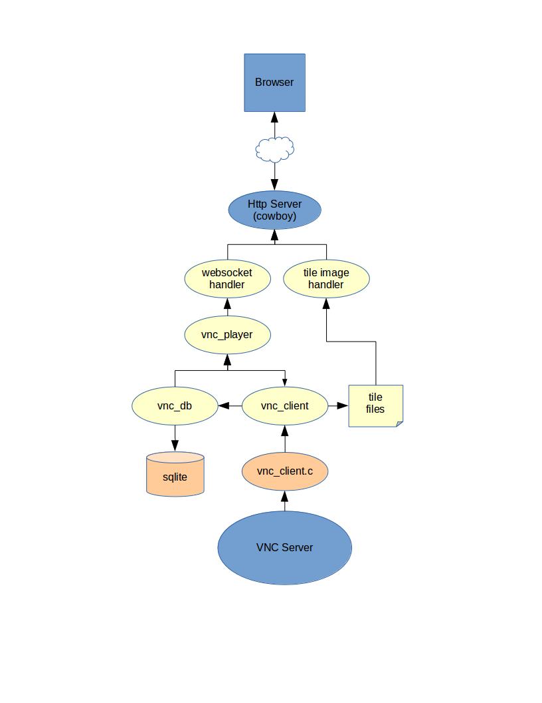

VNC Record/Replay in Elixir and HTML5
======================================

Run a VNC client in a web browser served up by an Elixir application

Installation
------------

Make sure you have elixir >= 1.0.0 installed.  Clone the repo, and change directory to it.  Run the following commands:

  1. make the C vnc client

    cd src && make

  2. start a test VNC server

    install vncserver, vncclient
    vncpasswd 123456
    ./vnc_server

  3. run the VNC web server application

    mix deps.get
    mix deps.compile
    iex -S mix

  4. open http://localhost:8080/static/vnc.html

Architecture
------------

Author
------

Noel Burton-Krahn <noel@burton-krahn.com>
